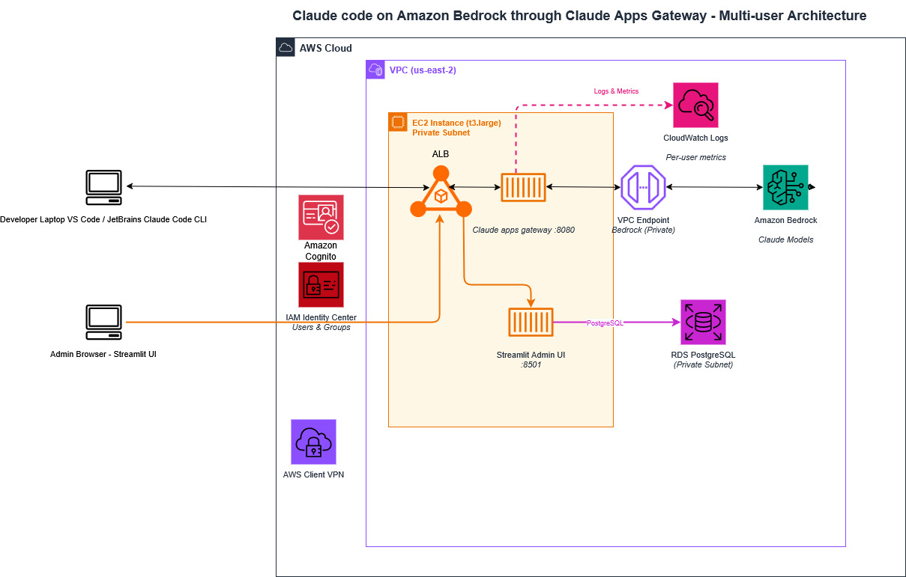

# Claude Code through Amazon Bedrock — Usage governance with Claude Apps Gateway & Streamlit UI

## What is Claude Apps Gateway?

Claude Apps Gateway is Anthropic's official self-hosted proxy that provides:

1. User-based authentication via OIDC
2. Per-user and per-group spend limits (daily/weekly/monthly with auto-reset)
3. Usage telemetry and audit logging
4. Native integration with Claude Code

## Architecture

```
Developer Machine (VPN Connected)
        ↓
Internal ALB (HTTPS:443, self-signed cert)
        ↓ (Listener Rules)
   ┌────────────────────┐
   │ /admin* → :8501    │  (Streamlit Admin App - Docker)
   │ default → :8080    │  (Claude Gateway Binary)
   └────────────────────┘
        ↓
   EC2 Instance (aws-region)
        ↓
   ┌─────────────────────────────────┐
   │ Claude Gateway (:8080)          │
   │   → Cognito (OIDC tokens)      │
   │   → IAM Identity Center (SSO)  │
   │   → Amazon Bedrock (models)    │
   │   → RDS PostgreSQL (spend DB)  │
   │   → CloudWatch (telemetry)     │
   │                                 │
   │ Streamlit Admin App (:8501)    │
   │   → Gateway Admin API          │
   │   → IAM Identity Center        │
   │   → RDS (audit logs)           │
   │   → CloudWatch (audit logs)    │
   └─────────────────────────────────┘
```



## Key Design Decision: VPN Required

1. Claude Code CLI rejects public ALB URLs (security restriction: "Gateway hosts must be on your organization's private network")
2. Internal ALB + VPN is the only supported path

## Why BOTH Cognito + IAM Identity Center?

- **IAM Identity Center**: Central user/group directory, SSO, single onboard/offboard point
- **Cognito**: Provides hosted login UI + OIDC token exchange (IDC alone can't do web-based OAuth callbacks)

## Prerequisites

| Requirement | Details |
|---|---|
| VPN | Site-to-site or client VPN to VPC |
| IAM Identity Center | Enabled in any aws region |
| RDS PostgreSQL | Existing or new (we reused llm-db.xxxx.aws-region.rds.amazonaws.com) |
| EC2 Instance | Amazon Linux 2023, in private subnet |
| Node.js | v18+ on EC2 (for Claude Code install) |
| Docker | On EC2 (for Streamlit admin app) |

## Software Versions

| Component | Version | Location |
|---|---|---|
| Claude Code (EC2 / Server) | v2.1.197 or latest | /root/.local/bin/claude |
| Claude Code (Developer machine) | v2.1.197 or latest | C:\Users\<username>\... |

---

## Amazon Cognito + IAM Identity Center

Amazon Cognito acts as the OIDC provider for the gateway. It federates with IAM Identity Center via SAML so developers still authenticate with their corporate SSO credentials.

### Create the Cognito User Pool

Run from Windows CMD (note: single quotes do not work on Windows; use double quotes with escaped inner quotes, or use JSON files):

**Option A: Use a JSON File (Recommended for Windows)**

Create a file named `pool-config.json`:

```json
{
  "PoolName": "claude-gateway-pool",
  "AutoVerifiedAttributes": ["email"],
  "UsernameAttributes": ["email"],
  "AdminCreateUserConfig": { "AllowAdminCreateUserOnly": true },
  "Schema": [{ "Name": "email", "Required": true, "Mutable": true }]
}
```

```bash
aws cognito-idp create-user-pool --cli-input-json file://pool-config.json ^
  --region <aws-region> --output json
```

> ⚠️ Note: If you get "Unknown output type: ada", your AWS CLI output format is set incorrectly. Fix it: `aws configure set output json`

**Result:** User Pool ID = aws-region_xxx (save this — used in all subsequent steps)

### Add Custom Attribute for Groups

```bash
aws cognito-idp add-custom-attributes ^
  --user-pool-id <aws-region_xxx> ^
  --custom-attributes "[{\"Name\":\"groups\",\"AttributeDataType\":\"String\",\"Mutable\":true}]" ^
  --region <aws-region> --output json
```

### Create Cognito Domain

```bash
aws cognito-idp create-user-pool-domain ^
  --domain "claude-gateway-samples" ^
  --user-pool-id <aws-region_xxx> ^
  --region <aws-region>
```

**Result:** Cognito domain = `https://claude-gateway-samples.auth.<aws-region>.amazoncognito.com`

### Create SAML Application in IAM Identity Center

- Go to IAM Identity Center → Applications → Add application
- Select "I have an application I want to set up" → Custom SAML 2.0 application
- Configure the following settings:

| Setting | Value |
|---|---|
| Display name | Cognito - Claude Gateway |
| Application ACS URL | `https://claude-gateway-samples.auth.<aws-region>.amazoncognito.com/saml2/idpresponse` |
| Application SAML audience | `urn:amazon:cognito:sp:<aws-region_xxx>` |

Configure attribute mappings:

| Application Attribute | Maps to | Format |
|---|---|---|
| Subject | ${user:email} | emailAddress |
| email | ${user:email} | unspecified |
| groups | ${user:groups} | unspecified |

- Download the SAML metadata XML file:
  1. Go to the application → IAM Identity Center metadata section
  2. Find the download link — it will open in the browser as XML
  3. Download the default (IPv4) version (not dual-stack)
  4. If browser opens it instead of downloading: press Ctrl+S, save as "idc-metadata.xml"
  5. Alternatively, copy the Metadata URL from the browser address bar to use directly

- Assign groups to the application (Claude Code user groups)

### Add IAM Identity Center as SAML IdP in Cognito

Using MetadataURL (easiest — Cognito fetches it automatically):

Create `provider-details.json`:

```json
{
  "MetadataURL": "paste the metadata url from the above step"
}
```

```bash
aws cognito-idp create-identity-provider ^
  --user-pool-id <aws-region_xxx> ^
  --provider-name "IAMIdentityCenter" ^
  --provider-type SAML ^
  --provider-details file://provider-details.json ^
  --attribute-mapping file://attribute-mapping.json ^
  --region ap-south-1 --output json
```

`attribute-mapping.json`:

```json
{"email": "email", "custom:groups": "groups", "name": "name"}
```

> ⚠️ Note: On Windows: the --attribute-mapping value with colons (custom:groups) causes parsing errors. Always use `file://attribute-mapping.json` instead of inline JSON.

### Create Cognito App Client

> ❌ CRITICAL: The callback URL must be `/oauth/callback` (NOT `/oauth2/idpresponse`). The `/oauth2/idpresponse` path is only for ALB authenticate-cognito action, which we are NOT using.

```bash
aws cognito-idp create-user-pool-client ^
  --user-pool-id <aws-region_xxx> ^
  --client-name "claude-apps-gateway" ^
  --generate-secret ^
  --supported-identity-providers "IAMIdentityCenter" ^
  --callback-urls "https://internal-claude-gateway-internal-alb-<xxx>.<aws-region>.elb.amazonaws.com/oauth/callback" ^
  --logout-urls "https://internal-claude-gateway-internal-alb-<xxx>.<aws-region>.elb.amazonaws.com" ^
  --allowed-o-auth-flows "code" ^
  --allowed-o-auth-flows-user-pool-client ^
  --allowed-o-auth-scopes "openid" "email" "profile" "phone" ^
  --region ap-south-1 --output json
```

✅ Actual Client ID obtained: xxxxxx

> ⚠️ Note: The Client Secret is shown ONLY ONCE in the output. Save it immediately.

---

## Pre-Token Generation Lambda — Critical Fix

> ❌ CRITICAL: Without this Lambda, the gateway ALWAYS rejects login with "id_token email is not verified". IAM Identity Center SAML federation does not set email_verified=true in Cognito tokens. This Lambda fixes that.

### Lambda Code (Python)

This Lambda does two things: (1) injects email_verified: true for all federated users, and (2) injects group membership as a groups claim for per-group policy enforcement:

`lambda_function.py`

### Deploy the Lambda

1. Create IAM execution role:

```bash
aws iam create-role --role-name claude-gateway-pre-token-role ^
  --assume-role-policy-document "{\"Version\":\"2012-10-17\",\"Statement\":[{\"Effect\":\"Allow\",\"Principal\":{\"Service\":\"lambda.amazonaws.com\"},\"Action\":\"sts:AssumeRole\"}]}" ^
  --region ap-south-1

aws iam attach-role-policy --role-name claude-gateway-pre-token-role ^
  --policy-arn arn:aws:iam::aws:policy/service-role/AWSLambdaBasicExecutionRole
```

Also the lambda should have below policy:

```json
{
    "Version": "2012-10-17",
    "Statement": [
        {
            "Effect": "Allow",
            "Action": [
                "identitystore:ListUsers",
                "identitystore:ListGroupMembershipsForMember",
                "identitystore:DescribeGroup"
            ],
            "Resource": "*"
        }
    ]
}
```

Package and deploy (on EC2 Linux):

```bash
cat > /tmp/lambda_function.py << 'EOF'
# paste the Python code above
EOF
cd /tmp && zip pre-token.zip lambda_function.py

aws lambda create-function ^
  --function-name cognito-pre-token-groups ^
  --runtime python3.12 ^
  --role arn:aws:iam::<aws-account-id>:role/claude-gateway-pre-token-role ^
  --handler lambda_function.lambda_handler ^
  --zip-file fileb:///tmp/pre-token.zip ^
  --region <aws-region> --output json
```

Grant Cognito permission to invoke Lambda:

```bash
aws lambda add-permission ^
  --function-name cognito-pre-token-groups ^
  --statement-id CognitoPreToken ^
  --action lambda:InvokeFunction ^
  --principal cognito-idp.amazonaws.com ^
  --source-arn arn:aws:cognito-idp:<aws-region>:<aws-account-id>:userpool/<aws-region_xxx> ^
  --region <aws-region>
```

Attach Lambda trigger to Cognito User Pool:

```bash
aws cognito-idp update-user-pool ^
  --user-pool-id <aws-region_xxx> ^
  --lambda-config PreTokenGenerationConfig="{\"LambdaVersion\":\"V2_0\",\"LambdaArn\":\"arn:aws:lambda:ap-south-1:<aws-account-id>:function:cognito-pre-token-groups\"}" ^
  --auto-verified-attributes email ^
  --region ap-south-1 --output json
```

---

## Internal ALB & TLS Certificate

> ❌ WHY INTERNAL ALB: The Claude Code CLI performs a security check that blocks connections to any gateway hostname resolving to a public IP. Using an internet-facing ALB causes the error: "Gateway hosts must be on your organization's private network". An internal ALB with VPN access is required.

### Find Private Subnets

```bash
aws ec2 describe-subnets --filters "Name=vpc-id,Values=vpc-xxx" ^
  --query "Subnets[*].[SubnetId,AvailabilityZone,MapPublicIpOnLaunch,CidrBlock]" ^
  --region <aws-region> --output table
```

Use subnets where MapPublicIpOnLaunch = False (those are private). You need at least 2 in different AZs.

Subnets used in this deployment: subnet-xxx (<aws-region-az>) and subnet-yyy (<aws-region-az>)

### Security Group Rules

This is the most common cause of target group health check failures. Both inbound AND outbound rules must be correct.

| Security Group | Direction | Port | Source/Dest | Purpose |
|---|---|---|---|---|
| ALB security group sg-123 | Inbound | 443 | <VPC CIDR IP> | HTTPS from VPC CIDR |
| ALB security group sg-123 | Outbound | 8080, 8501 | EC2 security group | To EC2 gateway+admin |
| EC2 security group sg-345 | Inbound | 8080, 8501 | ALB security group | From internal ALB |
| EC2 security group sg-345 | Outbound | All | [IP_ADDRESS]/0 | Required for ALB health check responses + Cognito + Bedrock |
| EC2 security group sg-345 | Outbound | 5432 | RDS security group | Required for connecting with RDS postgresql |
| RDS Security group sg-567 | Inbound | 5432 | EC2 security group | Required for connecting with RDS postgresql from EC2 |

### Create Internal ALB

```bash
aws elbv2 create-load-balancer ^
  --name claude-gateway-internal-alb ^
  --scheme internal ^
  --type application ^
  --subnets subnet-xxx subnet-yyy ^
  --security-groups sg-123 ^
  --region <aws-region> --output json
```

✅ ALB ARN: `arn:aws:elasticloadbalancing:<aws-region>:<aws-account-id>:loadbalancer/app/claude-gateway-internal-alb/xxx`
✅ ALB DNS: `internal-claude-gateway-internal-alb-xxx.<aws-region>.elb.amazonaws.com`

> ⚠️ Note: Internal ALBs automatically get "internal-" prefixed to their DNS name. This is important for the TLS certificate SAN.

### Generate Self-Signed TLS Certificate (on EC2)

> ⚠️ Note: OpenSSL is not available on Windows by default. Do all certificate steps on the EC2 instance via Session Manager.

> ❌ CN Field 64-Char Limit: The ALB DNS name is 69 characters (too long for CN). Always use a short CN and put the full DNS in the SAN extension. Failing to do this causes "string too long" error.

SSH into EC2 (via Session Manager) and run:

```bash
# Generate config file with short CN + full SAN
cat > /tmp/claude-gateway-cert.conf << 'EOF'

[req]
default_bits = 2048
prompt = no
default_md = sha256
distinguished_name = dn
x509_extensions = v3_req
[dn]
C = IN
ST = Maharashtra
L = Mumbai
O = Amazon Web Services
OU = Claude Gateway
CN = claude-gw
[v3_req]
subjectAltName = @alt_names
keyUsage = keyEncipherment, dataEncipherment
extendedKeyUsage = serverAuth
[alt_names]
DNS.1 = internal-claude-gateway-internal-alb-xxx.<aws-region>.elb.amazonaws.com
EOF

# Generate the certificate
openssl req -new -x509 -nodes \
  -keyout /tmp/gateway.key \
  -out /tmp/gateway.crt \
  -days 825 -config /tmp/claude-gateway-cert.conf

# Get SHA-256 fingerprint (share gateway.crt file with all developers which they need to configure in settings.json file in .claude folder in their machine)
openssl x509 -in /tmp/gateway.crt -noout -fingerprint -sha256

# Example output: SHA256 Fingerprint=[MAC_ADDRESS]...
```

settings.json file configuration:

```json
{
  "env": {
    "NODE_EXTRA_CA_CERTS": "C:\\Users\\<username>\\.claude\\gateway.crt"
  }
}
```

Import to ACM:

```bash
# Import to ACM
aws acm import-certificate \
  --certificate fileb:///tmp/gateway.crt \
  --private-key fileb:///tmp/gateway.key \
  --region <aws-region> --output json
```

✅ Certificate ARN: `arn:aws:acm:<aws-region>:<aws-account-id>:certificate/xxx`

### Create Target Groups

**Gateway Target Group (Port 8080)**

```bash
aws elbv2 create-target-group ^
  --name claude-gateway-internal-tg ^
  --protocol HTTP ^
  --port 8080 ^
  --vpc-id vpc-xxxx ^
  --target-type instance ^
  --health-check-path /health ^
  --health-check-interval-seconds 30 ^
  --region <aws-region> --output json
```

> ❌ IMPORTANT: The gateway returns HTTP 401 (not 200) on unauthenticated /health requests. You MUST update the health check matcher to include 401, or the target will always show as unhealthy.

```bash
# Update matcher to accept 401 as healthy
aws elbv2 modify-target-group ^
  --target-group-arn arn:aws:elasticloadbalancing:<aws-region>:<aws-account-id>:targetgroup/claude-gateway-internal-tg/xxx ^
  --matcher HttpCode=200-299,401 ^
  --region ap-south-1 --output json
```

**Admin/Streamlit Target Group (Port 8501)**

```bash
aws elbv2 create-target-group ^
  --name claude-admin-internal-tg ^
  --protocol HTTP ^
  --port 8501 ^
  --vpc-id vpc-xxx ^
  --target-type instance ^
  --health-check-path /admin/_stcore/health ^
  --health-check-interval-seconds 30 ^
  --region <aws-region> --output json
```

### Register EC2 in Target Groups

```bash
# Register EC2 in gateway target group
aws elbv2 register-targets ^
  --target-group-arn arn:aws:elasticloadbalancing:<aws-region>:<aws-account-id>:targetgroup/claude-gateway-internal-tg/xxx ^
  --targets Id=<ec2-instance-id> ^
  --region <aws-region>

# Register EC2 in admin target group
aws elbv2 register-targets ^
  --target-group-arn arn:aws:elasticloadbalancing:<aws-region>:<aws-account-id>:targetgroup/claude-admin-internal-tg/xxx ^
  --targets Id=<ec2-instance-id> ^
  --region <aws-region>
```

### Create HTTPS Listener (Passthrough — No Cognito Action)

> ⚠️ Note: The ALB is a simple TLS-terminating passthrough. The gateway handles all OIDC authentication itself. Do NOT add authenticate-cognito action here.

```bash
aws elbv2 create-listener ^
  --load-balancer-arn arn:aws:elasticloadbalancing:<aws-region>:<aws-account-id>:loadbalancer/app/claude-gateway-internal-alb/xxx ^
  --protocol HTTPS ^
  --port 443 ^
  --ssl-policy ELBSecurityPolicy-TLS13-1-2-2021-06 ^
  --certificates CertificateArn=arn:aws:acm:<aws-region>:<aws-account-id>:certificate/xxx ^
  --default-actions "[{\"Type\":\"forward\",\"TargetGroupArn\":\"arn:aws:elasticloadbalancing:<aws-region>:<aws-account-id>:targetgroup/claude-gateway-internal-tg/xxx\"}]" ^
  --region <aws-region> --output json
```

### Add Path Rule for Admin App (/admin*)

```bash
aws elbv2 create-rule ^
  --listener-arn <LISTENER_ARN_FROM_ABOVE> ^
  --priority 10 ^
  --conditions Field=path-pattern,Values="/admin*" ^
  --actions Type=forward,TargetGroupArn=arn:aws:elasticloadbalancing:<aws-region>:<aws-account-id>:targetgroup/claude-admin-internal-tg/xxx ^
  --region <aws-region> --output json
```

---

## Deploy Claude Apps Gateway

### Install Claude Code on EC2

```bash
# SSH into EC2 via Session Manager
aws ssm start-session --target <ec2-instance-id> --region <aws-region>

# Install Claude Code
curl -fsSL https://claude.ai/install.sh | sh

# Verify installation and binary path
which claude
# Result: /root/.local/bin/claude

claude --version
# Result: 2.1.197 (Claude Code)

# Verify gateway subcommand exists
claude gateway --help
```

✅ Binary location: `/root/.local/bin/claude` (NOT /home/ec2-user/.claude/bin/claude as originally assumed)

### Create Database on RDS

```bash
# Install PostgreSQL client
sudo dnf install postgresql16 -y

# Connect to existing RDS instance
psql "host=llm-db.xxx.<aws-region>.rds.amazonaws.com user=llm_admin dbname=postgres sslmode=require"
# Enter master password when prompted
```

```sql
-- Create gateway database, user and tables
CREATE DATABASE claude_gateway;
CREATE USER gateway_user WITH PASSWORD '<enter password here>';
GRANT ALL PRIVILEGES ON DATABASE claude_gateway TO gateway_user;
\c claude_gateway
GRANT ALL ON SCHEMA public TO gateway_user;
\c claude_gateway
CREATE TABLE IF NOT EXISTS audit_log (
    id SERIAL PRIMARY KEY,
    timestamp TIMESTAMPTZ NOT NULL DEFAULT NOW(),
    action VARCHAR(100) NOT NULL,
    target_type VARCHAR(50),
    target_id VARCHAR(255),
    target_name VARCHAR(255),
    details TEXT
);
CREATE INDEX idx_audit_timestamp ON audit_log(timestamp DESC);
CREATE INDEX idx_audit_action ON audit_log(action);

SELECT datname FROM pg_database WHERE datname = 'claude_gateway';
\dt   -- Should show audit_log table
\q
```

> ⚠️ Note: If `\l` command shows "column d.daticulocale does not exist" error, ignore it. This is a psql client version mismatch and does not affect functionality.

### Create Gateway Configuration Files

**Create Directory:**

```bash
mkdir -p /home/ec2-user/claude-gateway
cd /home/ec2-user/claude-gateway
```

**Generate JWT Secret:**

```bash
openssl rand -base64 32  # Run 3 times for JWT, read key, write key
# This outputs a random string e.g.: DyVZHEOI/+Ik1f+AOaUzPdeji3n5j21uMG08Ok6yF0o=
# Save this value for GATEWAY_JWT_SECRET in .env
```

**Create .env File:**

```bash
cat > /home/ec2-user/claude-gateway/.env << 'ENV'
NEW_ALB_DNS=internal-claude-gateway-internal-alb-xxx.<aws-region>.elb.amazonaws.com
COGNITO_ISSUER_URL=https://cognito-idp.<aws-region>.amazonaws.com/<aws-region>_xxx
COGNITO_CLIENT_ID=xxx
COGNITO_CLIENT_SECRET=<your-client-secret>
GATEWAY_JWT_SECRET=<output-of-openssl-rand-base64-32>
GATEWAY_POSTGRES_URL=postgres://gateway_user:<password>@litellm-db.xxx.<aws-region>.rds.amazonaws.com/claude_gateway?sslmode=require
GATEWAY_ADMIN_READ_KEY=<generated_with_openssl_rand_base64_32>
GATEWAY_ADMIN_WRITE_KEY=<generated_with_openssl_rand_base64_32>
ENV

chmod 600 /home/ec2-user/claude-gateway/.env
```

### Get Available Bedrock Inference Profiles

Before writing gateway.yaml, list the available global inference profiles in your account:

```bash
aws bedrock list-inference-profiles \
  --region <aws-region> \
  --query "inferenceProfileSummaries[?contains(inferenceProfileId,'claude')].[inferenceProfileId]" \
  --output table
```

Profiles available in this deployment:

| Inference Profile ID | Model |
|---|---|
| global.anthropic.claude-opus-4-8 | Claude Opus 4.8 (latest) |
| global.anthropic.claude-opus-4-7 | Claude Opus 4.7 |
| global.anthropic.claude-opus-4-6-v1 | Claude Opus 4.6 |
| global.anthropic.claude-sonnet-4-6 | Claude Sonnet 4.6 |
| global.anthropic.claude-sonnet-4-5-20250929-v1:0 | Claude Sonnet 4.5 |
| global.anthropic.claude-haiku-4-5-20251001-v1:0 | Claude Haiku 4.5 |
| global.anthropic.claude-fable-5 | Claude Fable 5 |
| global.anthropic.claude-sonnet-5 | Claude Sonnet 5 |
| apac.anthropic.claude-sonnet-4-20250514-v1:0 | Claude Sonnet 4 (APAC-only) |

### Create gateway.yaml — Final Working Configuration

This is the exact gateway.yaml that works in production. Every key was validated against the official Claude Apps Gateway documentation.

```yaml
# ================================================================
# Claude Apps Gateway Configuration
# Double Auth: ALB authenticate-cognito (L1) + Gateway OIDC (L2)
# ================================================================

listen:
  host: [IP_ADDRESS]
  port: 8080
  public_url: https://${NEW_ALB_DNS}

oidc:
  issuer: ${COGNITO_ISSUER_URL}
  client_id: ${COGNITO_CLIENT_ID}
  client_secret: ${COGNITO_CLIENT_SECRET}
  scopes:
    - openid
    - email
    - profile
  allowed_email_domains:
    - amazon.com
  userinfo_fallback: true

session:
  jwt_secret: ${GATEWAY_JWT_SECRET}
  ttl_hours: 1

store:
  postgres_url: ${GATEWAY_POSTGRES_URL}

upstreams:
  - provider: bedrock
    region: ap-south-1
    auth: {}

auto_include_builtin_models: true
models:
  - id: claude-opus-4-8
    label: Claude Opus 4.8
    upstream_model:
      bedrock: global.anthropic.claude-opus-4-8

  - id: claude-opus-4-7
    label: Claude Opus 4.7
    upstream_model:
      bedrock: global.anthropic.claude-opus-4-7

  - id: claude-opus-4-6
    label: Claude Opus 4.6
    upstream_model:
      bedrock: global.anthropic.claude-opus-4-6-v1

  - id: claude-sonnet-4-6
    label: Claude Sonnet 4.6
    upstream_model:
      bedrock: global.anthropic.claude-sonnet-4-6

  - id: claude-sonnet-4-5
    label: Claude Sonnet 4.5
    upstream_model:
      bedrock: global.anthropic.claude-sonnet-4-5-20250929-v1:0

  - id: claude-sonnet-4-20250514
    label: Claude Sonnet 4
    upstream_model:
      bedrock: apac.anthropic.claude-sonnet-4-20250514-v1:0

  - id: claude-haiku-4-5
    label: Claude Haiku 4.5
    upstream_model:
      bedrock: global.anthropic.claude-haiku-4-5-20251001-v1:0

  - id: claude-sonnet-5
    label: Claude Sonnet 5
    upstream_model:
      bedrock: global.anthropic.claude-sonnet-5

  - id: claude-fable-5
    label: Claude Fable 5
    upstream_model:
      bedrock: global.anthropic.claude-fable-5

admin:
  write_keys:
    - { id: admin-cli, key: <generated_with_openssl_rand_base64_32>}
  read_keys:
    - { id: streamlit-app, key: <generated_with_openssl_rand_base64_32> }
  admin_groups: [platform-admins]
  blocked_message: "Spend limit reached. Contact yourcompanyclaude@admin.com to request an increase."

# OTLP telemetry -> local CloudWatch Agent on port 4318
telemetry:
  forward_to:
    - url: http://[IP_ADDRESS]:4318
      metrics: true
      logs: true
      traces: false
```

### Create Systemd Service

> ❌ Binary Path: The service file must use `/root/.local/bin/claude` (where Claude Code installed). The path `/home/ec2-user/.claude/bin/claude` does NOT exist and causes status=203/EXEC error.

```bash
cat > /etc/systemd/system/claude-gateway.service << 'SVC'
[Unit]
Description=Claude Apps Gateway
After=network.target network-online.target
Wants=network-online.target

[Service]
Type=simple
User=root
WorkingDirectory=/home/ec2-user/claude-gateway
EnvironmentFile=/home/ec2-user/claude-gateway/.env
ExecStart=/root/.local/bin/claude gateway --config /home/ec2-user/claude-gateway/gateway.yaml
Restart=always
RestartSec=5
StandardOutput=journal
StandardError=journal

[Install]
WantedBy=multi-user.target
SVC

sudo systemctl daemon-reload
sudo systemctl enable claude-gateway
sudo systemctl start claude-gateway
```

### Verify Gateway is Running

```bash
# Check service status
sudo systemctl status claude-gateway

# Check logs
journalctl -u claude-gateway -n 50 --no-pager
```

Expected output shows:
1. Active: active (running)
2. `[gateway] info claude gateway listening on host [IP_ADDRESS] port 8080`
3. `[gateway] info public_url https://internal-claude-gateway-...`
4. `[gateway] info oidc issuer https://cognito-idp.ap-south-1.amazonaws.com/<aws-region>_xxx`
5. `[gateway] info upstreams 1: bedrock(bedrock)`
6. `[gateway] info telemetry relay: 1 destination`
7. `[gateway] info managed settings: configured`

```bash
# Test locally from EC2
curl -s http://<ec2-private-ip>:8080/health
# Expected: HTTP 401 Unauthorized - this is CORRECT (gateway is running)

# Check target group health
aws elbv2 describe-target-health \
  --target-group-arn arn:aws:elasticloadbalancing:<aws-region>:<aws-account-id>:targetgroup/claude-gateway-internal-tg/xxx \
  --region <aws-region> --output json
# Expected: "State": "healthy"
```

---

## CloudWatch OTLP Telemetry

### Install CloudWatch Agent

```bash
sudo dnf install amazon-cloudwatch-agent -y
```

### Configure OTLP Receiver

```bash
cat > /opt/aws/amazon-cloudwatch-agent/etc/otel-config.json << 'EOF'
{
  "metrics": {
    "metrics_collected": {
      "otlp": {
        "grpc_endpoint": "[IP_ADDRESS]",
        "http_endpoint": "[IP_ADDRESS]"
      }
    }
  },
  "logs": {
    "metrics_collected": {
      "otlp": {
        "grpc_endpoint": "[IP_ADDRESS]",
        "http_endpoint": "[IP_ADDRESS]"
      }
    }
  }
}
EOF
```

### Start CloudWatch Agent

```bash
sudo /opt/aws/amazon-cloudwatch-agent/bin/amazon-cloudwatch-agent-ctl \
  -m ec2 -a fetch-config \
  -c file:/opt/aws/amazon-cloudwatch-agent/etc/otel-config.json -s

# Verify it is listening on port 4318
ss -tlnp | grep 4318
# Expected: LISTEN 0 4096 *:4318 *:* users:(("amazon-cloudwat",pid=37249,fd=10))
```

> ⚠️ Note: OTEL SSRF Block: The gateway has SSRF protection that blocks connections to [IP_ADDRESS] ([IP_ADDRESS]). In gateway.yaml, use `url: http://[IP_ADDRESS]:4318` instead of `http://[IP_ADDRESS]:4318`. Both map to [IP_ADDRESS] but the explicit IP form may bypass SSRF checks in future versions.

CloudWatch metrics will appear in the CloudWatch console under a custom namespace after the first requests flow through the gateway. Check via:

```bash
aws cloudwatch list-metrics --region ap-south-1 --output json | grep -i namespace | sort -u
```

---

## Developer Onboarding

### Prerequisites on Developer Machine

1. AWS Client VPN connected (route to VPC CIDR via VPN)
2. Claude Code v2.1.197 or later installed
3. `gateway.crt` file saved locally (copy from EC2 `/tmp/gateway.crt`)

### Verify VPN is Connected

From PowerShell (not CMD):

```powershell
# Check routing table for VPN route to VPC
route print | findstr "<VPC CIDR>"
# Expected: <VPC CIDR IP>  [IP_ADDRESS]  [IP_ADDRESS]  [IP_ADDRESS]

# Test TCP connectivity to internal ALB
Test-NetConnection internal-claude-gateway-internal-alb-xxx.<aws-region>.elb.amazonaws.com -Port 443
# Expected: TcpTestSucceeded: True
```

### Create Managed Settings File

The managed-settings.json file tells Claude Code to use the gateway. Place it at the admin-managed location:

| OS | Path |
|---|---|
| Windows | C:\Program Files\ClaudeCode\managed-settings.json |
| macOS | /Library/Application Support/ClaudeCode/managed-settings.json |
| Linux | /etc/claude-code/managed-settings.json |

Create the file (run CMD as Administrator on Windows):

```bash
mkdir "C:\Program Files\ClaudeCode" 2>nul
```

Create `C:\Program Files\ClaudeCode\managed-settings.json`:

```json
{
  "forceLoginMethod": "gateway",
  "forceLoginGatewayUrl": "https://internal-claude-gateway-internal-alb-xxx.<aws-region>.elb.amazonaws.com",
  "env": {
    "NODE_EXTRA_CA_CERTS": "C:\\ProgramData\\ClaudeCode\\gateway.crt"
  }
}
```

### Distribute TLS Certificate to Developers

Since the gateway uses a self-signed certificate, developers need to trust it:

1. Copy the certificate content from EC2:

```bash
cat /tmp/gateway.crt    # Run on EC2
```

2. On developer Windows machine, create the directory and file:

```bash
mkdir "C:\ProgramData\ClaudeCode" 2>nul
# Paste the certificate content (including BEGIN/END CERTIFICATE lines)
# into: C:\ProgramData\ClaudeCode\gateway.crt
```

3. Optional: install in Windows trust store (no NODE_EXTRA_CA_CERTS needed):

```powershell
# Run PowerShell as Administrator
Import-Certificate -FilePath "C:\ProgramData\ClaudeCode\gateway.crt" -CertStoreLocation Cert:\LocalMachine\Root
```

### Developer Login Flow

Developers authenticate once using corporate SSO. No API keys required.

1. Open terminal and start Claude Code:
   ```
   claude
   ```
2. Verify managed settings are applied (you should see "Managed settings require approval"):
   Press Enter to accept the OTEL_EXPORTER_OTLP_ENDPOINT setting from managed-settings.json.
3. Type `/login` and press Enter:
   ```
   /login
   ```
4. Browser opens → Cognito login page → Identity Center SSO login
5. If already logged into Identity Center in browser: authentication is automatic (no password prompt)
6. Browser shows "You are signed in" → return to terminal
7. Verify login:
   ```bash
   claude auth status
   # Expected: { "loggedIn": true, "authMethod": "third_party", "apiProvider": "gateway" }
   ```

### Test the Connection

```bash
claude --model claude-sonnet-4-6 "hello, what model are you?"
# Expected: Response from Claude Sonnet 4.6 via Bedrock
```

---

## Streamlit Admin App (Docker)

The Streamlit Admin App provides a web UI for monitoring usage, managing users, and viewing spend per group. It connects to the gateway's PostgreSQL database and to Identity Center APIs.

### Streamlit Admin code

Copy `app.py` to below path: `/home/ec2-user/claude-gateway/`

### Dockerfile

```dockerfile
# /home/ec2-user/claude-gateway/Dockerfile
FROM python:3.12-slim
WORKDIR /app
COPY requirements.txt .
RUN pip install --no-cache-dir -r requirements.txt
COPY app.py .
EXPOSE 8501
CMD ["streamlit", "run", "app.py",
     "--server.port=8501", "--server.address=[IP_ADDRESS]",
     "--server.baseUrlPath=/admin"]
```

### requirements.txt

```
streamlit==1.35.0
pandas==2.2.0
boto3==1.34.0
psycopg2-binary==2.9.9
plotly==5.20.0
```

### Deploy

```bash
cd /home/ec2-user/claude-gateway

docker build -t claude-admin-app .

docker run -d --name claude-admin --restart always \
  -p 8501:8501 \
  -e ADMIN_PASSWORD=<[PASSWORD]> \
  -e GATEWAY_URL="https://internal-claude-gateway-internal-alb-xxx.<aws-region>.elb.amazonaws.com" \
  -e GATEWAY_ADMIN_WRITE_KEY=<generated_with_openssl_rand_base64_32> \
  -e GATEWAY_ADMIN_READ_KEY=<generated_with_openssl_rand_base64_32> \
  -e AWS_REGION=<aws-region> \
  -e IDENTITY_STORE_ID="d-xxx" \
  -e DATABASE_URL='postgresql://gateway_user:<PASSWORD>@litellm-db.xxx.<aws-region>.rds.amazonaws.com/claude_gateway?sslmode=require' \
  claude-admin-app \
  streamlit run app.py --server.port=8501 --server.address=[IP_ADDRESS] --server.headless=true --server.baseUrlPath=/admin
```

Access streamlit admin UI at: `https://internal-claude-gateway-internal-alb-xxx.<aws-region>.elb.amazonaws.com/admin/`

### Admin UI Features

| Page | What You Can Do |
|---|---|
| 📊 Usage Overview | Monthly spend KPIs, daily trend chart, top users by spend |
| 👥 User Management | View all users, disable/enable users (instantly revokes all sessions) |
| 💰 Spend Tracking | Per-user and per-group spend, budget utilization %, date range filter |
| 🏷️ Group Management | View/add/remove users from Identity Center groups (changes model access + budget) |
| 🚨 Alerts & Limits | Users approaching 80% of budget, users currently blocked |

---

## Adding New Models

Model access is controlled entirely in `gateway.yaml`. To change:

1. Edit `gateway.yaml` on EC2
2. Restart the gateway: `sudo systemctl restart claude-gateway`
3. Changes take effect immediately on the next request

---

## Troubleshooting — All Errors Encountered & Fixes

This section documents every error hit, exact error text, root cause, and the fix that worked.

| Error | Root Cause | Fix |
|---|---|---|
| Unknown options: true}' | Windows CMD: single quotes don't work for JSON args | Use JSON files: `aws cognito-idp create-user-pool --cli-input-json file://pool-config.json` |
| Unknown output type: ada | AWS CLI output format set to invalid value "ada" | Fix: `aws configure set output json` |
| string too long: maxsize=64 | OpenSSL CN field limited to 64 chars; ALB DNS = 69 chars | Use short CN (CN=claude-gw) and put full ALB DNS in [alt_names] SAN extension |
| status=203/EXEC | systemd cannot find or execute the binary path specified | Binary is at /root/.local/bin/claude (not /home/ec2-user/.claude/bin/). Verify with: `which claude` |
| Unrecognized key: groups, spend_limits | managed.policies format uses "match: {groups:}" not inline "groups:" | Use: `managed: policies: - match: { groups: [group_name] } spend_limits: monthly_usd: 100` |
| Unrecognized key: destinations | Telemetry uses forward_to not destinations | Use: `telemetry: forward_to: - url: http://[IP_ADDRESS]:4318` |
| Target.Timeout (health check) | EC2 security group was missing outbound rules — response traffic blocked | Add outbound all-traffic rule to EC2 SG: `authorize-security-group-egress --protocol -1 --cidr [IP_ADDRESS]/0` |
| Health check always unhealthy (401) | Gateway returns 401 on /health (requires auth) | Update target group matcher: `modify-target-group --matcher HttpCode=200-299,401` |
| redirect_mismatch | Cognito callback URL pointed to old public ALB | Update Cognito App Client: callback URL must be /oauth/callback (NOT /oauth2/idpresponse). Run: `update-user-pool-client --callback-urls` |
| invalid_scope error | Gateway requested offline_access scope; Cognito rejected it | Add explicit scopes to gateway.yaml oidc section: `scopes: [openid, profile, email]` — omit offline_access |
| id_token email is not verified | SAML-federated users from Identity Center do not have email_verified=true in Cognito token | Deploy Pre-Token Lambda that injects "email_verified": "true" in idTokenGeneration claimsToAddOrOverride. There is NO gateway config option to skip this check. |
| Gateway hosts must be on private network | Claude Code CLI security check blocks gateways resolving to public IPs | Use internal ALB (--scheme internal). Public ALB cannot be used with Claude Code CLI, regardless of any workarounds. |
| timeout of 10000ms exceeded | Developer machine can't reach internal ALB DNS or port 443 | VPN must be connected. Test: `Test-NetConnection <internal-alb-dns> -Port 443` (TcpTestSucceeded must be True) |
| 400 The provided model identifier is invalid | Gateway sends short model names (e.g. "claude-opus-4-7") to Bedrock; Bedrock doesn't recognize them | Add models: section in gateway.yaml mapping each model ID to its global.anthropic.* Bedrock inference profile. Use list-inference-profiles to find exact IDs. |
| DNS request timed out (nslookup) | nslookup used http:// prefix; or VPN DNS not routing to VPC resolver | Remove http:// from nslookup. To force VPC DNS: `nslookup <alb-[IP_ADDRESS]1.0.2` |
| Hostname/IP does not match cert's altnames | Certificate generated with placeholder ALB DNS, not actual DNS | Regenerate certificate with the exact internal ALB DNS in the SAN. Always check actual ALB DNS (includes internal- prefix) before generating cert. |

---

## Operations Runbook

| Task | Tool | Command / Steps |
|---|---|---|
| Add new developer | IAM Identity Center | Add user to appropriate Identity Center group. User can log in immediately with /login |
| Remove/offboard developer | IAM Identity Center | Remove from Identity Center group. Session expires within 1 hour (session.ttl_hours) |
| Change spend limit | gateway.yaml on EC2 | Edit gateway.yaml, change monthly_usd value, then: `sudo systemctl restart claude-gateway` |
| Add new model | gateway.yaml on EC2 | Add entry under models: section with bedrock: global.anthropic.<profile-id>, then restart |
| View per-user spend | PostgreSQL query | `SELECT user_email, SUM(cost_usd) FROM usage_logs WHERE created_at >= date_trunc('month', NOW()) GROUP BY user_email;` |
| Check gateway health | AWS CLI | `aws elbv2 describe-target-health --target-group-arn ...claude-gateway-internal-tg... --region ap-south-1` |
| View gateway logs | journalctl | `journalctl -u claude-gateway -n 50 --no-pager \| grep -v health` |
| Update gateway binary | npm | `/root/.local/bin/claude update` (or reinstall from claude.ai/install.sh) |
| Check Bedrock inference profile IDs | AWS CLI | `aws bedrock list-inference-profiles --region ap-south-1 --output table` |

---

## Appendix A — LiteLLM vs Claude Apps Gateway Feature Comparison

| Feature | LiteLLM | Gateway | Notes |
|---|---|---|---|
| Per-user spend budgets | ✅ | ✅ | Gateway: per-group via gateway.yaml |
| SSO authentication | ❌ Manual API keys | ✅ Native OIDC | Gateway eliminates API key management |
| Admin UI | ✅ Streamlit | ⏳ Build it | Gateway has no built-in UI; build Streamlit on same EC2 |
| Per-user model restrictions | ✅ Per virtual key | ✅ Per group | Gateway: group-level; use 1-person groups for per-user |
| TPM / RPM rate limits | ✅ Native | ❌ Spend only | Gateway only enforces spend caps, not token rate limits |
| Multi-model routing (OpenAI, etc.) | ✅ Any model | ❌ Claude only | Gateway routes only to Claude on Bedrock/Vertex/Foundry |
| Offboarding speed | ⚠️ Manual key revocation | ✅ Remove from IdP group | Gateway: expires within session.ttl_hours (default 1h) |
| Maintained by | You (self-managed) | Anthropic | Gateway updates ship inside the claude binary |
| VPN required | ✅ Yes | ✅ Yes (internal ALB) | Both require VPN for private network access |
| CI/CD / service token support | ✅ Static API keys | ❌ SSO only | Gateway requires interactive browser login; no service token


## Security

See [CONTRIBUTING](CONTRIBUTING.md#security-issue-notifications) for more information.

## License

This library is licensed under the MIT-0 License. See the LICENSE file.
